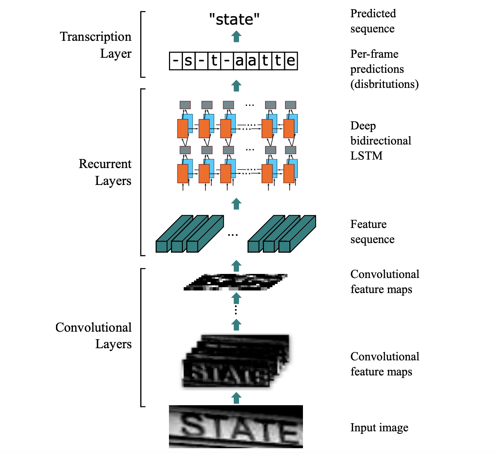

# CRNN Pytorch


## Quick Demo

```command
$ pip install -r requirements.txt
$ python src/predict.py -h
```

Everything is okay. Let's predict the demo images.

```command
$ python src/predict.py demo/*.jpg
device: cpu
Predict: 100% [00:00<00:00,  4.89it/s]

===== result =====
demo/170_READING_62745.jpg > reading
demo/178_Showtime_70541.jpg > showtime
demo/78_Novel_52433.jpg > novel
```


## CRNN + CTC

This is a Pytorch implementation of a Deep Neural Network for scene text recognition. It is based on the paper ["An End-to-End Trainable Neural Network for Image-based Sequence Recognition and Its Application to Scene Text Recognition (2016), Baoguang Shi et al."](http://arxiv.org/abs/1507.05717).

Blog article with more info: [https://ycc.idv.tw/crnn-ctc.html](https://ycc.idv.tw/crnn-ctc.html)



## Download Synth90k dataset

```command
$ cd data
$ bash download_synth90k.sh
```

```
@InProceedings{Jaderberg14c,
  author       = "Max Jaderberg and Karen Simonyan and Andrea Vedaldi and Andrew Zisserman",
  title        = "Synthetic Data and Artificial Neural Networks for Natural Scene Text Recognition",
  booktitle    = "Workshop on Deep Learning, NIPS",
  year         = "2014",
}

@Article{Jaderberg16,
  author       = "Max Jaderberg and Karen Simonyan and Andrea Vedaldi and Andrew Zisserman",
  title        = "Reading Text in the Wild with Convolutional Neural Networks",
  journal      = "International Journal of Computer Vision",
  number       = "1",
  volume       = "116",
  pages        = "1--20",
  month        = "jan",
  year         = "2016",
}
```

## Pretrained Model

We pretrained the RCNN model on [Synth90k](http://www.robots.ox.ac.uk/~vgg/data/text/) dataset. The weights saved at `checkpoints/crnn_synth90k.pt`.

### Evaluate the model on the Synth90k dataset

```command
$ python src/evaluate.py
```

Evaluate on 891927 Synth90k test images:

- Test Loss: 0.53042

| Decoded Method                   | Sequence Accuracy | Prediction Time  |
|----------------------------------|-------------------|------------------|
| greedy                           | 0.93873           | 0.44398 ms/image |
| beam_search (beam_size=10)       | 0.93892           | 6.9120  ms/image |
| prefix_beam_search (beam_size=10)| 0.93900           | 42.598  ms/image |


## Train your model

You could adjust hyper-parameters in `./src/config.py`.

And train crnn models,

```command
$ python src/train.py
```

## Acknowledgement

Please cite this repo. [crnn-pytorch](https://github.com/GitYCC/crnn-pytorch) if you use it.
